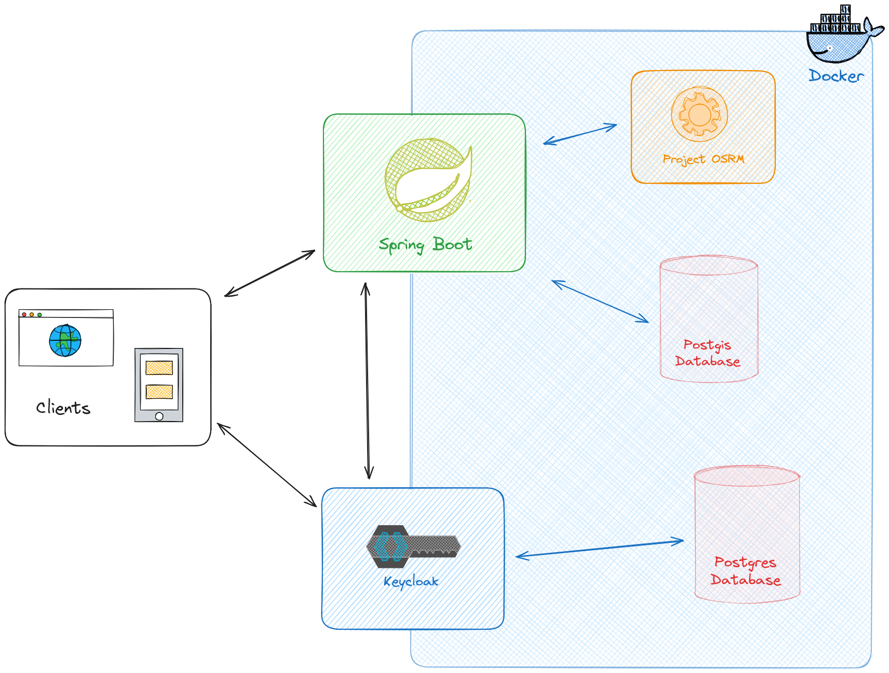
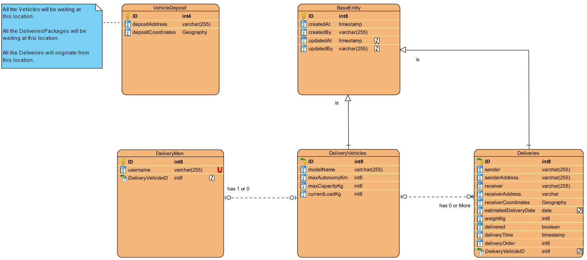

<a name="readme-top"></a>

<div>
<details>
  <summary>Table of Contents</summary>
  <ol>
    <li>
      <a href="#about-the-project">About The Project</a>
      <ul>
        <li><a href="#built-with">Built With</a></li>
      </ul>
    </li>
    <li>
     <a href="#architecture">Architecture</a>
      <ul>
        <li><a href="#system">System</a></li>
        <li><a href="#database">Database</a></li>
      </ul>
    </li>
    <li>
      <a href="#getting-started">Getting Started</a>
      <ul>
        <li><a href="#prerequisites">Prerequisites</a></li>
        <li><a href="#run">Run</a></li>
      </ul>
    </li>
    <li><a href="#example">Example</a></li>
    <li><a href="#keycloak">Keycloak</a></li>
    <li><a href="#license">License</a></li>
  </ol>
</details>

<!-- ABOUT THE PROJECT -->
## About The Project

This is the backend of GreenWay. GreenWay optimizes the routes for a fleet of electric vehicles, taking into account their load capacity, range, courier work shifts, and terrain elevation. By considering terrain elevation, GreenWay generates more efficient routes for electric vehicles, taking advantage of their ability to recharge batteries during downhill travel. GreenWay solves a variant of the [Travelling Salesman Problem](https://en.wikipedia.org/wiki/Travelling_salesman_problem), the [Vehicle Routing Problem](https://en.wikipedia.org/wiki/Vehicle_routing_problem). Deliveries are organized in such a way that a vehicle can deliver its load and return to the depot within the courier’s end-of-shift time, without the need for recharging breaks see the [example](https://github.com/Redy1908/GreenWay-Backend?tab=readme-ov-file#example).

### Built With

[![SpringBoot][SpringBoot]][SpringBoot-url][![Project OSRM][ProjectOSRM]][ProjectOSRM-url][![Keycloack][Keycloack]][Keycloack-url][![Java 21][Java]][Java-url][![Docker][Docker]][Docker-url]

<p align="right">(<a href="#readme-top">back to top</a>)</p>

<!-- Design -->
## Architecture

### System



<p align="right">(<a href="#readme-top">back to top</a>)</p>

### Database



<p align="right">(<a href="#readme-top">back to top</a>)</p>

<!-- GETTING STARTED -->
## Getting Started

Setting up the REST API is as easy as running a simple command

### Prerequisites

Make sure to install the following dependencies

* [Docker](https://docs.docker.com/desktop/)

### Run

Within the root folder execute:

```cmd
   docker compose up -d
```

<p align="right">(<a href="#readme-top">back to top</a>)</p>

## Example

Let’s consider a fleet of three vehicles, all waiting at the depot (withe dot on the map) and 11 deliveries
(yellow dots on the map):


Suppose that inside our fleet of three vehicles we have one vehicle capable of doing all the deliveries in one take
the algorithm output will be:


Now let's limit the number of deliveries for the three vehicles to 4:


<p align="right">(<a href="#readme-top">back to top</a>)</p>

## Keycloak

> :warning: This set up is only for development/prototyping <u>DO NOT</u> use it in production :warning:

GreenWay uses [KeyCloak](https://www.keycloak.org/) as its Identity and Access Management (IAM) system.
A pre-configured realm and the following users are already configured:

```
Username: admin
Password: admin
KeyCloak default admin
```
```
Username: GREEN_WAY_ADMIN
Password: 12345
with GREEN_WAY_ADMIN ROLE
```
```
Username: deliverymanX where X can be 1-2-3-4-5
Password: 12345
with GREEN_WAY_DELIVERY_MAN ROLE
```

If you want to edit the Keycloak configuration or add new users, access the
KeyCloak [dashboard](http://localhost:8090/) using the default admin profile.

<p align="right">(<a href="#readme-top">back to top</a>)</p>

## License

This project is licensed under the Creative Commons Attribution-ShareAlike 4.0 International (CC BY-SA 4.0) License - see the [LICENSE file](https://github.com/Redy1908/GreenWay-Backend/blob/main/LICENSE) for details.

<p align="right">(<a href="#readme-top">back to top</a>)</p>


[SpringBoot]: https://img.shields.io/badge/SpringBoot-6DB33F?style=for-the-badge&logo=Spring&logoColor=white
[SpringBoot-url]: https://spring.io/projects/spring-boot
[ProjectOSRM]: https://img.shields.io/badge/Project_OSRM-black?style=for-the-badge&logo=openstreetmap&logoColor=6DB33F
[ProjectOSRM-url]: https://project-osrm.org/
[Docker]: https://img.shields.io/badge/Docker-2496ED?style=for-the-badge&logo=docker&logoColor=white
[Docker-url]: https://www.docker.com/
[Java]:https://img.shields.io/badge/Java-ED8B00?style=for-the-badge&logo=openjdk&logoColor=white
[Java-url]:https://www.oracle.com/it/java/technologies/downloads/
[Keycloack]:https://img.shields.io/badge/Keycloak-purple?style=for-the-badge&logo=keycloak&logoColor=FFFFFF
[Keycloack-url]: https://www.keycloak.org/

[Github-url-1]: https://github.com/Redy1908/GreenWay-Backend/blob/a669dbe472d8ff0ce111a6f76280de9bd6a24f0e/osrm/Dockerfile-osrm-elevation#L6
[Github-url-2]: https://github.com/Redy1908/GreenWay-Backend/blob/a669dbe472d8ff0ce111a6f76280de9bd6a24f0e/GreenWay/src/main/resources/application.yml#L27
[Github-url-3]: https://github.com/Redy1908/GreenWay-Backend/blob/a669dbe472d8ff0ce111a6f76280de9bd6a24f0e/GreenWay/src/main/resources/application.yml#L28
[Github-url-4]: https://github.com/Redy1908/GreenWay-Backend/blob/a669dbe472d8ff0ce111a6f76280de9bd6a24f0e/GreenWay/src/main/resources/application.yml#L29
[Github-url-5]: https://github.com/Redy1908/GreenWay-Backend/blob/a669dbe472d8ff0ce111a6f76280de9bd6a24f0e/GreenWay/src/main/resources/application.yml#L30
[Github-url-6]: https://github.com/Redy1908/GreenWay-Backend/blob/a669dbe472d8ff0ce111a6f76280de9bd6a24f0e/docker-compose.yml#L65
[Github-url-7]: https://github.com/Redy1908/GreenWay-Backend/blob/a669dbe472d8ff0ce111a6f76280de9bd6a24f0e/GreenWay/pom.xml#L132C1-L132C26
[Github-url-8]: https://github.com/Redy1908/GreenWay-Backend/blob/a47ae71ee16a85db0d704b584f9cbfb288b84ad7/opentopodata/config.yaml#L2
