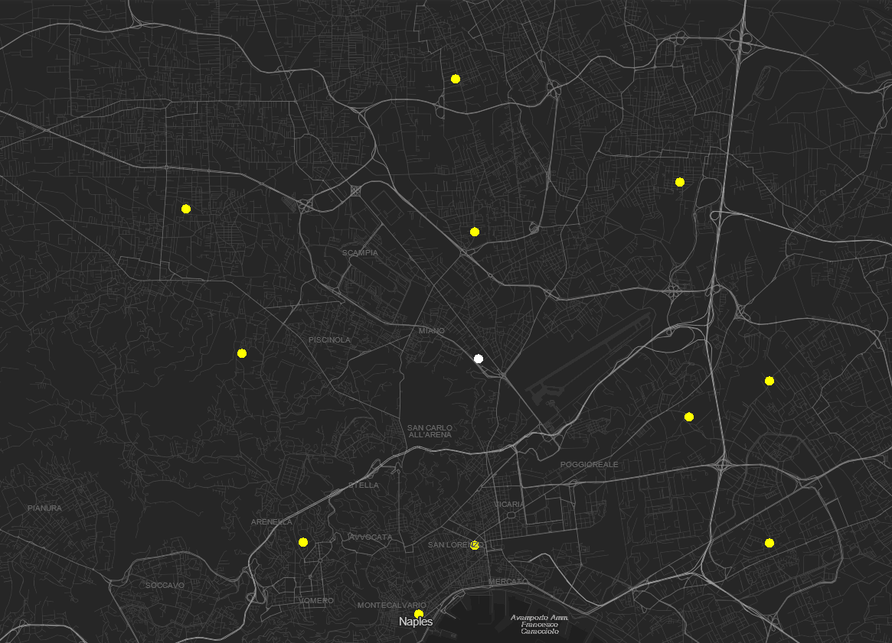
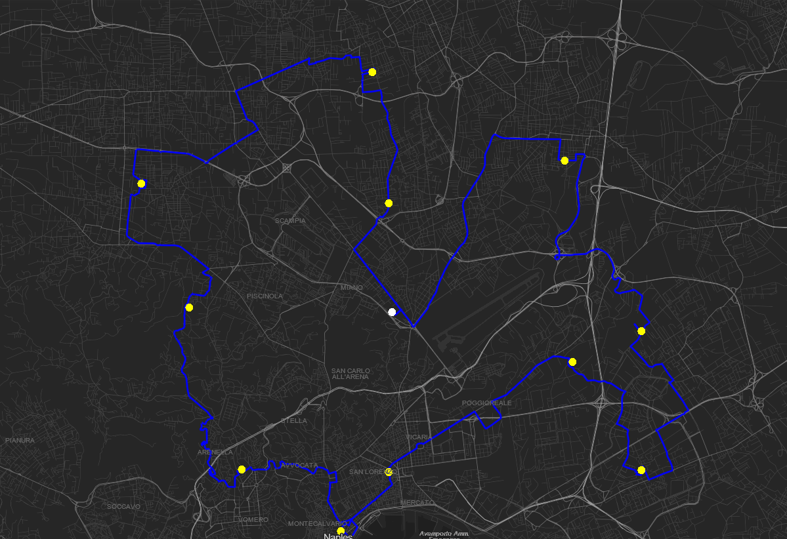
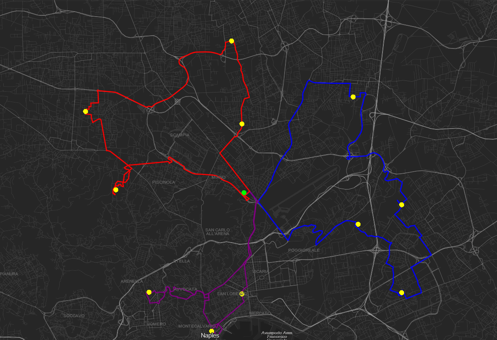

<a name="readme-top"></a>

<!-- PROJECT LOGO -->
<br />
<div style="text-align: center">
  <a href="https://github.com/Redy1908/GreenWay-Backend">
    
  </a>

<h3 align="center">GreenWay</h3>

  <p style="text-align: center">
    Routing and optimization of Electric Vehicle paths,
    in a context of goods delivery in territories with complex terrain.  
  </p>
</div>

<br>

<details>
  <summary>Table of Contents</summary>
  <ol>
    <li>
      <a href="#about-the-project">About The Project</a>
      <ul>
        <li><a href="#built-with">Built With</a></li>
      </ul>
    </li>
    <li>
      <a href="#getting-started">Getting Started</a>
      <ul>
        <li><a href="#prerequisites">Prerequisites</a></li>
        <li><a href="#run">Run</a></li>
      </ul>
    </li>
    <li><a href="#usage">Usage</a></li>
    <li><a href="#example">Example</a></li>
    <li>
     <a href="#customization">Customization</a>
      <ul>
        <li><a href="#keycloak">Keycloak</a></li>
        <li><a href="#OSRM-OpenTopoData">OSMR and Open Topo Data</a></li>
      </ul>
    </li>
  </ol>
</details>

<!-- ABOUT THE PROJECT -->
## About The Project

This is the Backend of GreenWay, an innovative project focused on the routing and optimization of electric vehicle (EV) paths, specifically within the challenging context of goods delivery across complex terrains.
The project uniquely considers altitude variations in its optimization algorithms, ensuring the most efficient routes for electric vehicles. Furthermore, GreenWay effectively addresses the
[Travelling Salesman Problem](https://en.wikipedia.org/wiki/Travelling_salesman_problem) by organizing deliveries in a manner that allows vehicles to return to the depot without the need for
recharging breaks. This strategic approach not only enhances delivery efficiency but also aims to extend the range and usability of electric vehicles in goods delivery.

### Built With

* [![SpringBoot][SpringBoot]][SpringBoot-url]
* [![Keycloack][Keycloack]][Keycloack-url]
* [![Project OSRM][ProjectOSRM]][ProjectOSRM-url]
* [![Open Topo Data][OpenTopoData]][OpenTopoData-url]
* [![Java][Java]][Java-url]
* [![Docker][Docker]][Docker-url]

<p style="text-align: right">(<a href="#readme-top">back to top</a>)</p>

<!-- GETTING STARTED -->
## Getting Started

Setting up the REST API is as easy as running a simple command

### Prerequisites

Make sure to install the following dependencies

* [Docker](https://docs.docker.com/desktop/)

### Run

Within the root folder execute:

```cmd
   docker compose up -d
```

<p style="text-align: right">(<a href="#readme-top">back to top</a>)</p>


<!-- USAGE EXAMPLES -->
## Usage

**TODO**

<p style="text-align: right">(<a href="#readme-top">back to top</a>)</p>

## Example

Let’s consider a fleet of three vehicles, all waiting at the depot (withe dot on the map) and 11 deliveries
(yellow dots on the map):



Suppose that inside our fleet of three vehicles we have one vehicle capable of doing all the deliveries in one take
the algorithm output will be:



Now let's limit the number of deliveries for the three vehicles to 4:



<p style="text-align: right">(<a href="#readme-top">back to top</a>)</p>

<!-- Customization -->
## Customization

GreenWay Backend is easily customizable to your needs.

### Keycloak

> :warning: This set up is only for development/prototyping <u>DO NOT</u> use it in production :warning:

GreenWay uses [KeyCloak](https://www.keycloak.org/) as its Identity and Access Management (IAM) system.
A pre-configured realm and the following users are already configured:

```
Username: admin
Password: admin
KeyCloak default admin
```
```
Username: GREEN_WAY_ADMIN
Password: 12345
with GREEN_WAY_ADMIN ROLE
```
```
Username: deliverymanX where X can be 1-2-3-4-5
Password: 12345
with GREEN_WAY_DELIVERY_MAN ROLE
```

If you want to edit the Keycloak configuration or add new users, access the
KeyCloak [dashboard](http://localhost:8090/) using the default admin profile.

### OSRM-OpenTopoData

GreenWay comes preconfigured with the map of Southern Italy and the relative elevation data. You can customize that.

1. Download map data for your location from [Geofabrik](https://www.geofabrik.de/)
2. You will get a file named `your-location.osm.pbf`
3. Move the file to `osrm/data/`
4. Go to `osrm/` edit the `Dockerfile-osrm-elevation.yml` at line [6][Github-url-1] set `OSRM_FILE` value to `your-location` with no extension
5. [Download](https://srtm.csi.cgiar.org/srtmdata/) the elevation data for your location, download both the `Esri ASCII` and `Geo TIFF` format
6. You will get two files, move the `.asc` file to `osrm/data/`
7. Open the file end note the content of the first `6` lines
8. Go to `osrm/` edit the `Dockerfile-osrm-elevation.yml` file, from line `7` to `13` according to your `.asc` file
9. Remove the first `6` lines from the  `.asc` file, save the changes
10. Go to `oepntopodata/data` create a new folder `yourDatasetFolder/` move the downloaded `.tif` file inside this folder
11. Edit the file `oepntopodata/config.yml` set the `name` end `path` to your dataset
12. Go to `GreenWay/src/main/resources` edit the files `application.yml` and `application-local.yml`, lines [27][Github-url-2]-[28][Github-url-3]-[29][Github-url-4]-[30][Github-url-5] with
    your max and min coordinates.
13. Run the following command inside `osrm/`:
    - `docker build -t {dockerHubUsername}/{imageName}:{imageTag} -f Dockerfile-osrm-elevation .`
14. Edit the ```docker-compose.yml``` file in the root directory, line [65][Github-url-6], replace the `image` value with the name of your image
15. Go to `GreenWay/` edit the `pom.xml` line [132][Github-url-7] replace `redy1908` with Docker Hub Username
16. Run the following command inside `GreenWay/`:
    - `./mvnw -DskipTests spring-boot:build-image `
17. Edit the ```docker-compose.yml``` file in the root directory, line [65][Github-url-6], replace the `image` value with the name of your image

[SpringBoot]: https://img.shields.io/badge/SpringBoot-6DB33F?logo=Spring&logoColor=white
[SpringBoot-url]: https://spring.io/projects/spring-boot
[ProjectOSRM]: https://img.shields.io/badge/Project_OSRM_with_OpenStreetMap-white?logo=openstreetmap&logoColor=6DB33F
[ProjectOSRM-url]: https://project-osrm.org/
[Docker]: https://img.shields.io/badge/Dokcer-2496ED?style=flat-square&logo=docker&logoColor=white
[Docker-url]: https://project-osrm.org/
[Java]:https://img.shields.io/badge/Java-ED8B00?logo=openjdk&logoColor=white
[Java-url]:https://www.oracle.com/it/java/technologies/downloads/
[Keycloack]:https://img.shields.io/badge/Keycloak-white?logo=keycloak&logoColor=4D4D4D
[Keycloack-url]: https://www.keycloak.org/
[OpenTopoData]: https://img.shields.io/badge/Open_Topo_Data-blue
[OpenTopoData-url]: https://www.opentopodata.org/

[Github-url-1]: https://github.com/Redy1908/GreenWay-Backend/blob/a669dbe472d8ff0ce111a6f76280de9bd6a24f0e/osrm/Dockerfile-osrm-elevation#L6
[Github-url-2]: https://github.com/Redy1908/GreenWay-Backend/blob/a669dbe472d8ff0ce111a6f76280de9bd6a24f0e/GreenWay/src/main/resources/application.yml#L27
[Github-url-3]: https://github.com/Redy1908/GreenWay-Backend/blob/a669dbe472d8ff0ce111a6f76280de9bd6a24f0e/GreenWay/src/main/resources/application.yml#L28
[Github-url-4]: https://github.com/Redy1908/GreenWay-Backend/blob/a669dbe472d8ff0ce111a6f76280de9bd6a24f0e/GreenWay/src/main/resources/application.yml#L29
[Github-url-5]: https://github.com/Redy1908/GreenWay-Backend/blob/a669dbe472d8ff0ce111a6f76280de9bd6a24f0e/GreenWay/src/main/resources/application.yml#L30
[Github-url-6]: https://github.com/Redy1908/GreenWay-Backend/blob/a669dbe472d8ff0ce111a6f76280de9bd6a24f0e/docker-compose.yml#L65
[Github-url-7]: https://github.com/Redy1908/GreenWay-Backend/blob/a669dbe472d8ff0ce111a6f76280de9bd6a24f0e/GreenWay/pom.xml#L132C1-L132C26